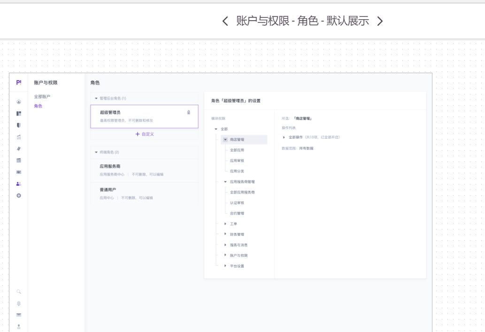
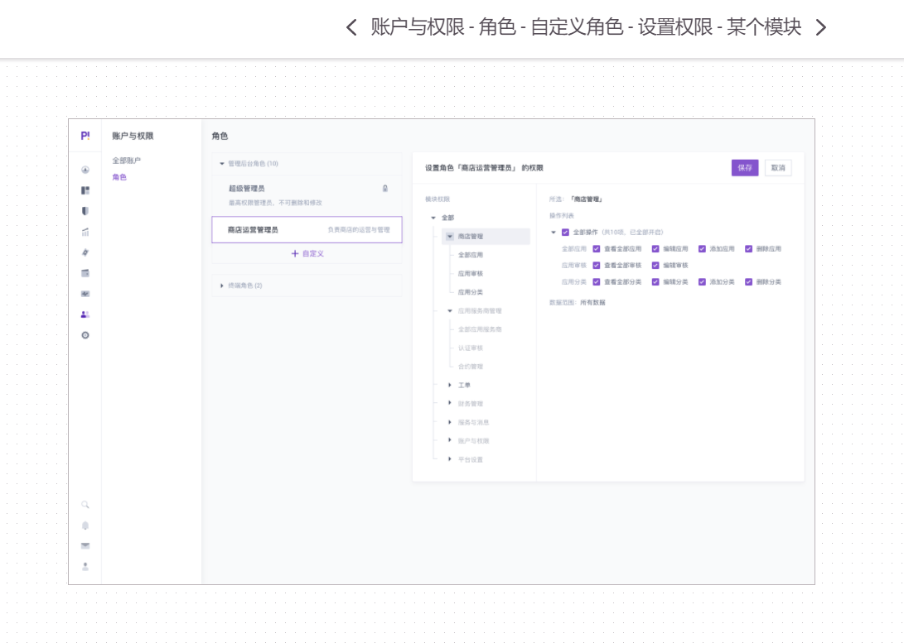

# IAM - 账户和权限

先了解和OpenPitrix业务相关的几个核心概念。

**组织部门和用户**


对应 im 账号管理模块中的group和user数据库表的概念，其中group是树形的组，user是在树形组织结构的叶子位置。

group表中有个gid唯一表示了组的位置信息，比如下面每一行为一个组的gid，每个gid对应组织结构中组的路径：

```
gid: /QingCloud应用中心
gid: /QingCloud应用中心/内部组织
gid: /QingCloud应用中心/内部组织/应用平台开发部
gid: /QingCloud应用中心/内部组织/应用平台开发部/OpenPitrix
gid: /QingCloud应用中心/内部组织/应用平台开发部/AppCenter
gid: /QingCloud应用中心/内部组织/应用平台开发部/KubeSphere
gid: /QingCloud应用中心/内部组织/云平台Iaas开发部
gid: /QingCloud应用中心/内部组织/云平台Iaas开发部/...

gid: /外部组织
gid: /外部组织/应用服务商
gid: /外部组织/普通用户
```

group表中有个gid_parent唯一表示了父亲组的位置信息。如果gid_parent和gid相同，则表示为根组。比如下面几个组的对应关系：

```
# 根
gid: /
gid_parent: /

# QingCloud应用中心
gid: /QingCloud应用中心
gid_parent: /

# OpenPitrix
gid: /QingCloud应用中心/内部组织/应用平台开发部/OpenPitrix
gid_parent: /QingCloud应用中心/内部组织/应用平台开发部
```

用户处于组织结构的叶子节点。为了便于管理，OpenPitrix预置了“超级管理员”/“应用服务商”/“普通用户”。为了便于理解，我们假设reno用户拥有“超级管理员”权限，ray用户拥有“应用服务商”权限，而chai用户拥有“普通用户”。

在user表中，uid表示用户唯一的标识，gid表示用户属于的组。那么以上三个用户的信息如下：

```
# admin
uid: reno
gid: /QingCloud应用中心/内部组织/X
name: reno

# isv
uid: ray
gid: /QingCloud应用中心/内部组织/应用平台开发部
name: ray

# user
uid: chai
gid: /QingCloud应用中心/内部组织/应用平台开发部/OpenPitrix
name: chaishushan
```

目前，三个用户没有任何的操作权限。如果需要给他们配置不同级别的权限，需要给他们赋予具有不同权限的角色。

**角色管理**



图中有“超级管理员”/“应用服务商”/“普通用户”三种角色。每个角色有一个唯一的角色名字，这三个角色的名字分别是role_root/role_isv/role_user。对应 am 权限管理模块中的role数据库表的概念。

我们可以将reno/ray/chai分布绑定到不同的角色：

```
reno <--> role_root
ray  <--> role_isv
chai <--> role_user
```

然后给每个角色附带一组`操作权限`规则：

```
role_root - 超级管理员
	action_rule:
		method_pattern: *.*
		namespace_pattern: [
			"/**"
		]
role_isv  - 应用服务商
	action_rule:
		method_pattern: *.*
		namespace_pattern: [
			"$gid/**"
		]
role_user - 普通用户
	action_rule:
		method_pattern: *.*
		namespace_pattern: [
			"$gid/$uid/**"
		]
```

在操作规则中`$gid`表示账户所在的组织部门的绝对路径，`$uid`表示账号的ID。

**操作权限**



商店管理，增删改查
